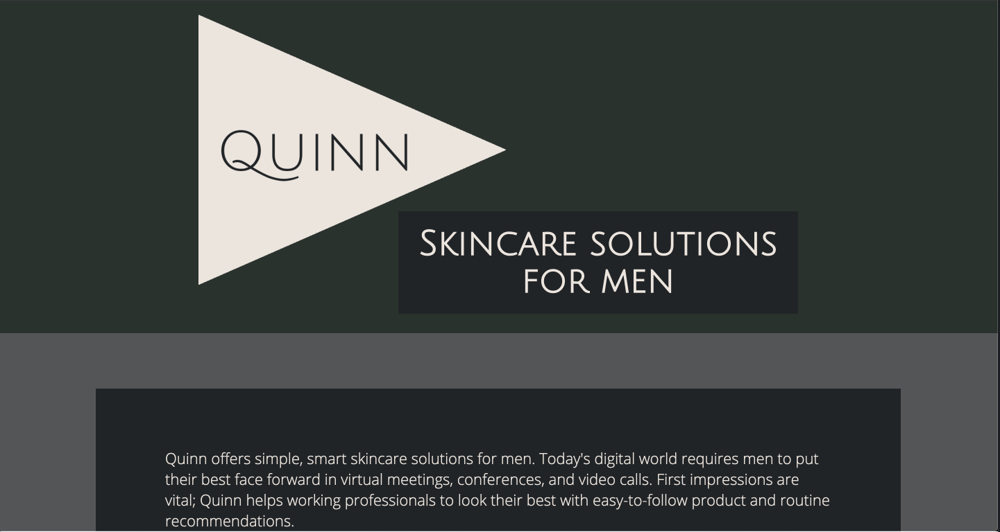

# 💁🏽‍♂️ [Quinn](https://quinn-skincare.herokuapp.com/)
A web app to recommend clean skincare products for men.

Users will take a short survey regarding their skin concerns, and the app will recommend them a curated selection of products.



## :hammer: Quinn is built with:
- [Python3](https://www.python.org/downloads/)
- [jQuery](https://jquery.com/)
- [Heroku](https://www.heroku.com/)

## :earth_americas: View on the web:
[Quinn](https://quinn-skincare.herokuapp.com/)

## 🤓 Authors
- [Amy Wang](https://github.com/xiwang129)
- [Mwiza Simbeye](https://github.com/mwizasimbeye11)
- [Ebonne Cabarrus](https://github.com/ebonnecab)
- [Elizabeth Tackett](https://github.com/emtackett)

Quinn was created for Summer 2020 MLH Fellowship Halfway Hackathon

## 💻 Run locally
- Clone the repository: `git clone https://github.com/MLH-Fellowship/Quinn.git`
- From the command line, navigate to the Quinn directory and run the following:

```bash
pip3 install --upgrade pip
pip install -r requirements.txt
flask run run.py
```

Visit `http://127.0.0.1:5000/` in your browser.
